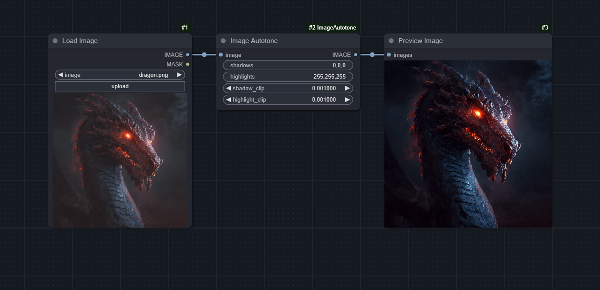
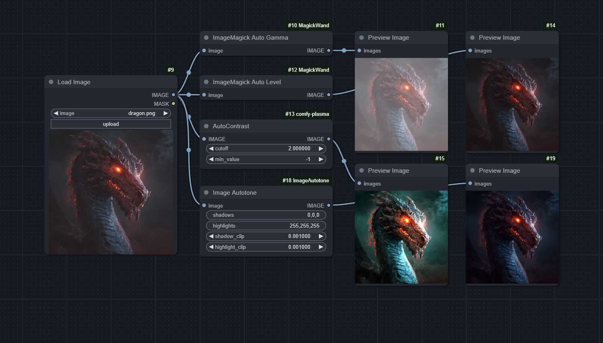

# ComfyUI-ImageAutotone

A node for [ComfyUI](https://github.com/comfyanonymous/ComfyUI) that takes an input image and clips the color channels independently to increase contrast and alter color cast. This is a reinterpretation of PhotoShop's "Auto Tone" algorithm.

Special thank you to Gerald Bakker for his writeup on Adobe's various algorithms:

- https://geraldbakker.nl/psnumbers/auto-options.html

### Installation

Simply drag the image above into ComfyUI and use [ComfyUI Manager » Install Missing Custom Nodes](https://github.com/ltdrdata/ComfyUI-Manager).

### Inputs

- `image`: The input image(s) to process with the autotone algorithm
- `shadows`: The color that defines the shadows of the image. This should be a comma-separated RGB value (e.g., '0,0,0' for black) or HEX string (e.g. '#000000').
- `highlights`: The color that defines the highlights in the image. This should be a comma-separated RGB value (e.g., '255,255,255' for white) or HEX string (e.g. '#FFFFFF').
- `shadow_clip`: The percentage of pixels to clip from the shadows. This is a value between 0 and 1.
- `highlight_clip`: The percentage of pixels to clip from the highlights. This is a value between 0 and 1.

### Bonus Comparison

Below is a workflow that demonstrates the difference between Image Autotone and a few other image contrast nodes on the ComfyUI Registry.

---

This node was adapted from the `[image_edit]` shortcode of [Unprompted](https://github.com/ThereforeGames/unprompted), my Automatic1111 extension.